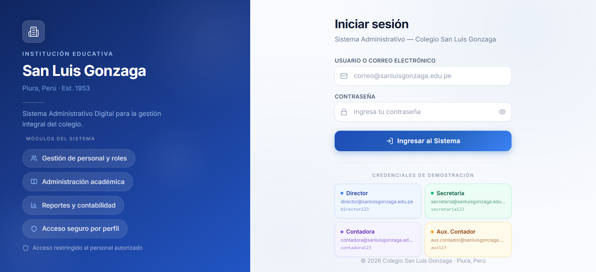
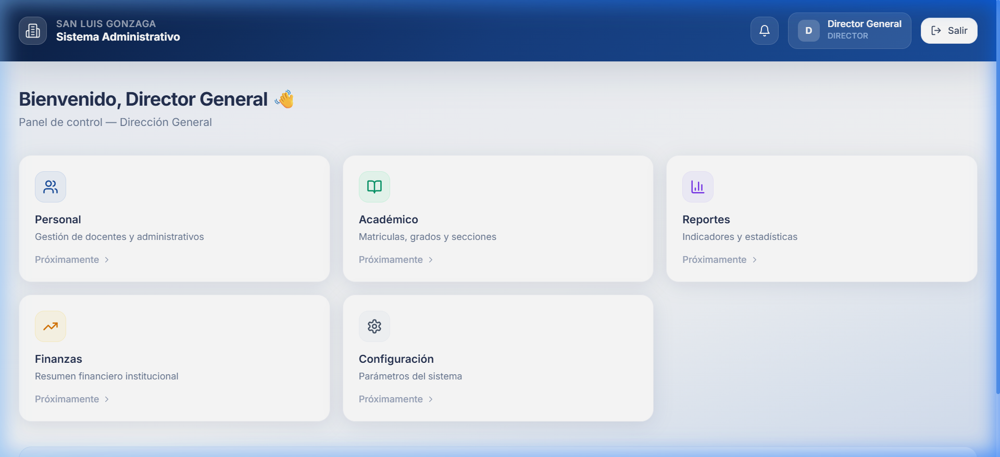
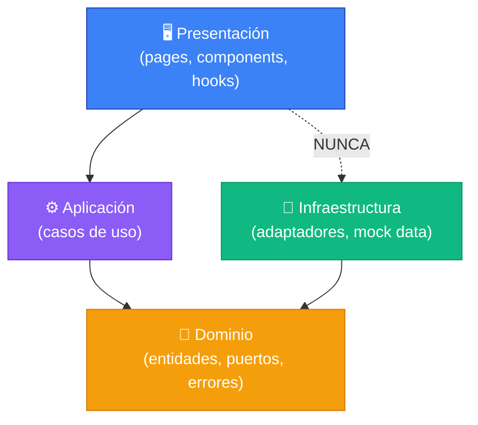

<p align="center">
  
  
  
  
  
</p>

<h1 align="center">🏫 Sistema Administrativo — Colegio San Luis Gonzaga</h1>

<p align="center">
  <strong>Sistema de gestión administrativa digital</strong> para la I.E. San Luis Gonzaga (Piura, Perú).<br/>
  Autenticación por roles, dashboards diferenciados y arquitectura limpia.
</p>

<p align="center">
  <a href="#-capturas">Capturas</a> •
  <a href="#-características">Características</a> •
  <a href="#️-arquitectura">Arquitectura</a> •
  <a href="#-stack-tecnológico">Stack</a> •
  <a href="#-instalación">Instalación</a> •
  <a href="#-estructura-del-proyecto">Estructura</a> •
  <a href="#-credenciales-de-demo">Demo</a>
</p>

---

## 📸 Capturas

<table>
  <tr>
    <td width="50%">
      <p align="center"><strong>🔐 Login</strong></p>
      
    </td>
    <td width="50%">
      <p align="center"><strong>📊 Dashboard del Director</strong></p>
      
    </td>
  </tr>
</table>

---

## ✨ Características

| Módulo | Descripción |
|--------|-------------|
| 🔐 **Autenticación** | Login con validación de formularios (Zod + React Hook Form) |
| 👥 **Roles diferenciados** | Director, Secretaria, Contadora y Aux. Contador |
| 🛡️ **Rutas protegidas** | Guardias de ruta por rol con redirección automática |
| 📊 **Dashboards** | Panel de control personalizado para cada perfil |
| 🎨 **UI Premium** | Diseño split-screen, glassmorphism, micro-animaciones |
| 📱 **Responsive** | Adaptable a escritorio, tablet y móvil |

---

## 🏛️ Arquitectura

El proyecto implementa **Arquitectura Hexagonal** (Ports & Adapters) con separación estricta de capas:

```
┌─────────────────────────────────────────────────────┐
│                   PRESENTACIÓN                       │
│         (React Components, Pages, Hooks)             │
├─────────────────────────────────────────────────────┤
│                   APLICACIÓN                         │
│              (Casos de Uso / Use Cases)              │
├─────────────────────────────────────────────────────┤
│                     DOMINIO                          │
│     (Entidades, Puertos, Value Objects, Errores)     │
├─────────────────────────────────────────────────────┤
│                 INFRAESTRUCTURA                      │
│          (Adaptadores, Repositorios Mock)             │
└─────────────────────────────────────────────────────┘
```

### Reglas de dependencia



> **Regla de oro:** La presentación **nunca** importa directamente de infraestructura.

---

## 🛠️ Stack Tecnológico

| Categoría | Tecnología |
|-----------|------------|
| **Framework** | React 18 + Vite 5 |
| **Lenguaje** | TypeScript (modo estricto, cero `any`) |
| **Estilos** | Tailwind CSS 3 + CSS modular |
| **Routing** | React Router DOM v6 |
| **Formularios** | React Hook Form + Zod |
| **Iconos** | Lucide React |
| **Build** | PostCSS + postcss-import + Autoprefixer |
| **Linting** | ESLint 9 + typescript-eslint |

---

## 🚀 Instalación

### Prerrequisitos

- **Node.js** ≥ 18
- **npm** ≥ 9

### Pasos

```bash
# 1. Clonar el repositorio
git clone https://github.com/LeandroUniversitario/sistema-escolar.git
cd sistema-escolar

# 2. Instalar dependencias
npm install

# 3. Iniciar el servidor de desarrollo
npm run dev
```


### Scripts disponibles

| Comando | Descripción |
|---------|-------------|
| `npm run dev` | Servidor de desarrollo con HMR |
| `npm run build` | Build de producción (TypeScript + Vite) |
| `npm run preview` | Preview del build de producción |
| `npm run lint` | Análisis estático con ESLint |

---

## 📂 Estructura del Proyecto

```
src/
├── domain/                    # 💎 Capa de Dominio (TypeScript puro)
│   └── auth/
│       ├── entities.ts        #    Entidades y tipos (User, UserRole)
│       ├── ports.ts           #    Interfaces de repositorios
│       ├── errors.ts          #    Errores de dominio tipados
│       ├── result.ts          #    Tipo Result para manejo de errores
│       └── value-objects.ts   #    Value Objects (Email, Password)
│
├── application/               # ⚙️ Capa de Aplicación
│   └── auth/
│       └── LoginUseCase.ts    #    Caso de uso: autenticación
│
├── infrastructure/            # 🔌 Capa de Infraestructura
│   └── auth/
│       ├── MockAuthRepository.ts  # Adaptador mock del repositorio
│       └── mock-data.ts          # Datos de prueba
│
├── pages/                     # 📄 Páginas
│   ├── LoginPage.tsx          #    Composición de la página de login
│   ├── DirectorDashboard.tsx  #    Dashboard del Director
│   ├── SecretariaDashboard.tsx
│   ├── ContadoraDashboard.tsx
│   └── AuxContadorDashboard.tsx
│
├── components/                # 🧩 Componentes reutilizables
│   ├── ProtectedRoute.tsx     #    Guardia de rutas por rol
│   └── login/
│       ├── BrandingPanel.tsx  #    Panel izquierdo institucional
│       ├── LoginForm.tsx      #    Formulario de login
│       ├── FormFields.tsx     #    Campos de email, password, submit
│       └── DemoCredentials.tsx #   Tarjetas de credenciales demo
│
├── hooks/                     # 🪝 Custom Hooks
│   ├── useAuth.ts             #    Consumo del AuthContext
│   └── useLoginForm.ts        #    Lógica del formulario de login
│
├── context/                   # 🌐 React Context
│   └── AuthContext.tsx        #    Provider global de autenticación
│
├── styles/                    # 🎨 CSS Modular
│   ├── base.css               #    Reset, tipografía, scrollbar
│   ├── login.css              #    Layout del login
│   ├── forms.css              #    Inputs, botones, errores
│   └── components.css         #    Demo cards, badges, dashboard
│
├── App.tsx                    #    Router principal
├── main.tsx                   #    Entry point
└── index.css                  #    Punto de entrada CSS (imports)
```

---

## 🔑 Credenciales de Demo

La aplicación incluye credenciales de prueba precargadas:

| Rol | Correo | Contraseña |
|-----|--------|------------|
| 🔵 **Director** | `director@sanluisgonzaga.edu.pe` | `director123` |
| 🟢 **Secretaria** | `secretaria@sanluisgonzaga.edu.pe` | `secretaria123` |
| 🟣 **Contadora** | `contadora@sanluisgonzaga.edu.pe` | `contadora123` |
| 🟡 **Aux. Contador** | `aux.contador@sanluisgonzaga.edu.pe` | `aux123` |

> Haz clic en cualquier tarjeta de credenciales en el login para autocompletar los campos.

---

## 📐 Principios de Código

Este proyecto sigue reglas estrictas de calidad:

- ✅ **Máximo 150 líneas por archivo** — Si crece, se divide
- ✅ **TypeScript estricto** — Cero `any`, cero `@ts-ignore`
- ✅ **YAGNI** — Solo código que se necesita ahora
- ✅ **DRY** — Lógica duplicada se extrae a utilidades
- ✅ **SRP** — Cada archivo tiene una sola responsabilidad
- ✅ **Inmutabilidad** — Sin mutaciones directas de estado

---

## 👨‍💻 Autores

Desarrollado como proyecto académico para el **V Ciclo — Análisis de Sistemas**

**Universidad Nacional de Piura** · 2026

---

<p align="center">
  <sub>Hecho con ❤️ en Piura, Perú</sub>
</p>
